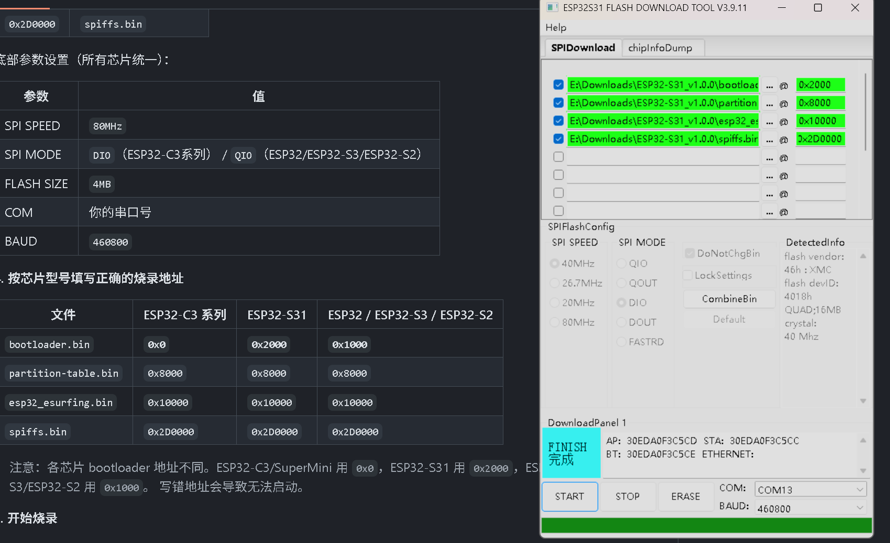

# ESP32 ESurfing — 天翼校园网自动认证客户端

> 基于 [ESurfingClient-CVersion](https://github.com/BadGhost520/ESurfingClient-CVersion) 移植到 ESP32系列 的校园网自动认证工具。

## 适用人群

- **在校大学生** — 使用中国电信天翼校园网的宿舍用户
- **需要自动认证** — 路由器不方便刷机/不想折腾 OpenWrt，用 ESP32 旁路认证
- **ESP32系列玩家** — 手上有 ESP32-C3 SuperMini 或其他 ESP32 开发板

## 功能

- ✅ **自动认证** — 检测到 captive portal 重定向后自动完成登录
- ✅ **心跳保活** — 按服务器指定间隔发送心跳，保持不掉线
- ✅ **断线重连** — WiFi 断开自动重连，认证失败自动重试（无限）
- ✅ **Web 配置后台** — AP `ESurfing-Config` 常开，浏览器访问 `http://192.168.4.1` 配置
- ✅ **WiFi + 校园网账号** — 均可通过网页修改，保存后自动重启
- ✅ **PCB 天线适配** — 已为 ESP32-C3 SuperMini 降低 TX 功率（8.5 dBm）
- ✅ **7×24 小时运行** — 插电运行，无需维护

## 工作原理

```
┌─────────────────────────────────────────────────┐
│                    ESP32                        │
│  ┌────────────┐    ┌────────────────────────┐   │
│  │ WiFi STA   │───▶│  检测 captive portal   │   │
│  │ (校园网)   │    │  (GET generate_204)     │   │
│  └────────────┘    └────────┬───────────────┘   │
│                             ▼                   │
│  ┌────────────────────────────────────────┐     │
│  │  302 重定向 → 提取 portal 配置          │     │
│  └────────────────┬───────────────────────┘     │
│                   ▼                             │
│  ┌────────────────────────────────────────┐     │
│  │  init_session → 获取加密算法和会话       │     │
│  ├────────────────────────────────────────┤     │
│  │  get_ticket → 请求认证票据              │     │
│  ├────────────────────────────────────────┤     │
│  │  login → 提交用户名密码完成登录          │     │
│  ├────────────────────────────────────────┤     │
│  │  heartbeat → 保活（每 N 秒一次）         │     │
│  └────────────────────────────────────────┘     │
│                                                 │
│  ┌──────────────────────────────┐               │
│  │ SoftAP: ESurfing-Config      │◀── 手机连接   │
│  │ Web: http://192.168.4.1      │    改配置      │
│  └──────────────────────────────┘               │
└─────────────────────────────────────────────────┘
```

## 支持的开发板

本项目已编译固件适配以下芯片，覆盖市面上绝大多数 ESP32 开发板：

| 芯片 | 常见开发板 | 架构 | WiFi 频段 | 5GHz 支持 | 特点 |
|------|-----------|------|-----------|-----------|------|
| **ESP32** | ESP32-DevKitC, NodeMCU-32S, ESP-WROOM-32 | Xtensa 双核 | 2.4GHz | ❌ | 最经典，市场保有量最大 |
| **ESP32-S3** | ESP32-S3-DevKitC-1, S3-Box, T-Display-S3 | Xtensa 双核 | 2.4GHz | ❌ | USB-OTG, 大 RAM, AI 加速 |
| **ESP32-S31** | ESP32-S31-DevKitC | RISC-V 单核 | 2.4GHz | ❌ | 最新款，性能更强 |
| **ESP32-C6** | ESP32-C6-DevKitC-1, Xiao ESP32-C6 | RISC-V 单核 | 2.4GHz WiFi 6 | ❌ | 新一代 WiFi 6，开发板丰富 |
| **ESP32-C5** | ESP32-C5-DevKitC | RISC-V 单核 | **2.4GHz + 5GHz 双频 WiFi 6** | **✅ ⭐ 唯一支持** | **可直连路由器 5GHz 频段** |
| **ESP32-C61** | ESP32-C61-DevKitC-1 | RISC-V 单核 | 2.4GHz WiFi 6 | ❌ | C6 升级版 |
| **ESP32-C3** | ESP32-C3-DevKitC-02, C3 SuperMini | RISC-V 单核 | 2.4GHz | ❌ | 低成本, RISC-V 架构 |
| **ESP32-S2** | ESP32-S2-Saola-1, S2-Mini | Xtensa 单核 | 2.4GHz | ❌ | 原生 USB, 无蓝牙 |
| **ESP32-C3 SuperMini** | C3 SuperMini 专用版 | RISC-V 单核 | 2.4GHz | ❌ | 已降功率适配 PCB 天线 |

> ⚠️ **WiFi 频段重要说明**
> - **只有 ESP32-C5 支持 5GHz WiFi**（双频 2.4GHz + 5GHz），其余芯片**仅支持 2.4GHz**。
> - 如果路由器开启了双频合一（2.4GHz 和 5GHz 同名），ESP32 可能无法连接。建议在路由器后台**单独开启一个 2.4GHz 专用 WiFi** 给 ESP32 使用。
> - 所有版本均需要 **4MB Flash**。不支持 2MB Flash 的 ESP32-C2。
> 
> 固件可在 [GitHub Releases](https://github.com/MYHealer/esp32_esurfing/releases)（GitHub）或 [Gitee Releases](https://gitee.com/MYHealer/esp32_esurfing/releases)（Gitee）下载，选择对应芯片的 zip 包。

## 网络拓扑与使用步骤

### 典型组网

```
┌───────────────────┐      ┌──────────────────┐        ┌──────────────────┐
│   校园网墙插       │──────│  家用路由器       │        │  ESP32 开发板    │
│   (天翼认证)       │      │  (WAN口接校园网)  │◀────▶│ (自动认证客户端)  │
└───────────────────┘      │  开启2.4GHz WiFi  │       │  连接路由器WiFi   │
                           │  LAN口接电脑/设备  │       └──────────────────┘
                           └────────┬──────────┘
                                    │
                           ┌────────▼──────────┐
                           │  手机/电脑/平板    │
                           │  连接路由器WiFi    │
                           │  自动上网          │
                           └───────────────────┘
```

### 详细使用步骤

**① 连接路由器**

用网线将**家用路由器的 WAN 口**连接到宿舍墙上的校园网网口。路由器设为动态 IP 模式，由校园网分配 IP。

**② 设置路由器 2.4GHz WiFi**

进入路由器管理后台：
- 确保 **2.4GHz WiFi 已开启**
- 建议单独设置一个 **2.4GHz 专用 WiFi**（名称可区别于 5GHz）
- 如果路由器支持双频合一，建议关闭，否则 ESP32 可能无法连接
- 记住 WiFi 名称和密码，后续配置 ESP32 时需要填写

**③ 烧录固件到 ESP32**

从 [GitHub Releases](https://github.com/MYHealer/esp32_esurfing/releases)（GitHub）或 [Gitee Releases](https://gitee.com/MYHealer/esp32_esurfing/releases)（Gitee）下载对应芯片的固件 zip 包，按下方「快速开始」中的方法烧录。

**④ 配置 ESP32**

开发板上电后：
1. 手机搜索并连接 WiFi `ESurfing-Config`（无密码）
2. 浏览器打开 `http://192.168.4.1`
3. 在 Web 配置页面填写：
   - **WiFi SSID** → 上一步设置的**路由器的 2.4GHz WiFi 名称**
   - **WiFi 密码** → 路由器的 WiFi 密码
   - **用户名** → 校园网账号
   - **密码** → 校园网密码
   - **通道** → phone 或 pc
4. 点击保存，ESP32 自动重启

**⑤ 自动认证**

ESP32 会自动连接到路由器 WiFi，检测校园网 captive portal 后完成登录认证，并持续发送心跳保持在线。

**⑥ 全屋上网**

认证成功后，所有连接到该路由器（无论是 WiFi 还是 LAN 口）的手机、电脑、平板等设备均可正常上网。

## 快速开始

### 下载固件

从 [GitHub Releases](https://github.com/MYHealer/esp32_esurfing/releases)（GitHub）或 [Gitee Releases](https://gitee.com/MYHealer/esp32_esurfing/releases)（Gitee）下载对应芯片的 `XXX_v1.0.0.zip` 包。

每个 zip 包含：
- `bootloader.bin` — 引导程序
- `partition-table.bin` — 分区表
- `esp32_esurfing.bin` — 应用程序
- `spiffs.bin` — 配置文件分区
- `flash_guide.txt` — 该芯片的烧录参数
- `README.md` — 完整说明

## 使用 Flash Download Tool 烧录

> [Flash Download Tool](https://docs.espressif.com/projects/esp-test-tools/en/latest/esp32/production_stage/tools/flash_download_tool.html) 是乐鑫官方的 Windows GUI 烧录工具，适合不熟悉命令行的用户。

### 准备工作

1. 下载并安装 [Flash Download Tool](https://docs.espressif.com/projects/esp-test-tools/en/latest/esp32/production_stage/tools/flash_download_tool.html)（**ESP32 Flash Download Tool** 版本）
2. 下载对应芯片的 `XXX_v1.0.0.zip` 并解压，固件包含：
   - `bootloader.bin` — 引导程序
   - `partition-table.bin` — 分区表
   - `esp32_esurfing.bin` — 应用程序
   - `spiffs.bin` — SPIFFS 配置分区
3. 使用 USB 数据线连接开发板到电脑
4. 打开设备管理器确认串口号（如 COM3、COM14）

### 烧录步骤

**1. 打开 Flash Download Tool**

启动 `flash_download_tool_x.x.x.exe`，根据芯片型号选择：

| 你的芯片 | Chip Type 选择 |
|----------|---------------|
| ESP32-C3 SuperMini / ESP32-C3 | **ESP32-C3** |
| ESP32-S3 | **ESP32-S3** |
| ESP32 | **ESP32** |
| ESP32-S2 | **ESP32-S2** |

Load Mode 选择 **UART**，点击 **OK**。

**2. 配置烧录参数**

在所有 4 个固件行的输入框中填入地址和文件路径：

| Address | File |
|---------|------|
| `0x0` | `bootloader.bin` |
| `0x8000` | `partition-table.bin` |
| `0x10000` | `esp32_esurfing.bin` |
| `0x2D0000` | `spiffs.bin` |

底部参数设置（所有芯片统一）：

| 参数 | 值 |
|------|-----|
| SPI SPEED | `80MHz` |
| SPI MODE | `DIO`（ESP32-C3系列） / `QIO`（ESP32/ESP32-S3/ESP32-S2） |
| FLASH SIZE | `4MB` |
| COM | 你的串口号 |
| BAUD | `460800` |

**3. 按芯片型号填写正确的烧录地址**

| 文件 | ESP32-C3 系列 | **ESP32-S31** | ESP32 / ESP32-S3 / ESP32-S2 |
|------|-------------|--------------|-----------------------------|
| `bootloader.bin` | **`0x0`** | **`0x2000`** | **`0x1000`** |
| `partition-table.bin` | `0x8000` | `0x8000` | `0x8000` |
| `esp32_esurfing.bin` | `0x10000` | `0x10000` | `0x10000` |
| `spiffs.bin` | `0x2D0000` | `0x2D0000` | `0x2D0000` |

> 注意：各芯片 bootloader 地址不同。ESP32-C3/SuperMini 用 `0x0`，ESP32-S31 用 `0x2000`，ESP32/ESP32-S3/ESP32-S2 用 `0x1000`。
> 写错地址会导致无法启动。

### 烧录界面参考图



**4. 开始烧录**

- 勾选所有 4 个固件前面的 **√** 复选框
- 点击 **START** 按钮
- 等待进度条完成（约 10-15 秒）
- 状态显示 **FINISH** 即烧录完成

**5. 上电运行**

- 烧录完成后，按一下开发板的 **RST** 按钮（或重新上电）
- ESP32 会自动启动，手机搜索到 `ESurfing-Config` WiFi

### 注意事项

- **不要勾选** `DoNotChkBin` 或跳过校验，否则可能烧录后无法启动
- **先擦除再烧录**：如遇到旧数据干扰，先点 `Erase` 擦除全部 Flash，再重新烧录
- **USB 线必须是数据线**：充电线无法烧录
- **Windows 驱动**：ESP32-C3 SuperMini 使用内置 USB-Serial-JTAG，Win10/Win11 自动识别，无需额外驱动

## 配置说明

### Web 后台

| 字段 | 说明 | 示例 |
|------|------|------|
| WiFi SSID | 2.4g WiFi 名称（不支持 5g） | `ChinaNet` |
| WiFi 密码 | 2.4g WiFi 密码 | 可留空 |
| 用户名 | 校园网账号 | 学号或手机号 |
| 密码 | 校园网密码 |  |
| 通道 | 认证类型 | `phone`（手机）或 `pc`（电脑） |

连接 `ESurfing-Config` → 浏览器访问 `http://192.168.4.1`

### SPIFFS 配置文件

`/spiffs/ESurfingClient.json` 为认证客户端读取的配置，`/spiffs/config.json` 为 Web 后台和 WiFi 配置共用。保存 Web 配置时会同步写入两个文件。

## 技术栈

| 组件 | 方案 |
|------|------|
| **主控** | ESP32-C3 (RISC-V, 160MHz) |
| **框架** | ESP-IDF v5.5 |
| **工具链** | Arduino RISC-V GCC (esp-rv32 2601-cn) |
| **HTTP** | esp_http_client |
| **Web 服务器** | esp_http_server |
| **配置存储** | SPIFFS (1.2MB 分区) |
| **加密库** | mbedTLS 3.x + 自实现 DES/3DES/SM4/ZUC |
| **JSON 解析** | cJSON |

## 认证协议

支持中国电信天翼校园网 CCTP 协议，包含以下加密算法：

AES-CBC, AES-ECB, 3DES-CBC, 3DES-ECB, DES-ECB(6轮), SM4-CBC, SM4-ECB, ZUC-128, ModXTEA 及其变体

## 项目结构

```
esp32_esurfing/
├── main/                          # 主程序
│   ├── app_main.c                 # 入口
│   ├── wifi_manager.c/h           # WiFi 管理（AP+STA 模式）
│   └── web_config.c/h             # Web 配置后台
├── components/
│   └── esurfing_core/             # 认证逻辑（移植自 CVersion）
│       ├── src/DialerClient.c     # 认证流程主控
│       ├── src/NetClient.c        # HTTP 请求
│       ├── src/States.c           # 状态管理
│       └── src/cipher/            # 17 种加密算法
├── spiffs_data/                   # SPIFFS 配置模板
│   ├── config.json                # Web 配置
│   └── ESurfingClient.json        # 认证客户端配置
├── build_v55.py                   # 构建脚本 (IDF v5.5)
└── sdkconfig.defaults             # ESP-IDF 配置
```

## 常见问题

### WiFi 连不上

- ESP32-C3 SuperMini PCB 天线信号较弱，确保靠近路由器
- **ESP32 全系列不支持 5g WiFi**，请确认路由器开启了 2.4g 频段
- 已在代码中降低 TX 功率（8.5 dBm），如仍不稳定可尝试 `esp_wifi_set_max_tx_power(28)`
- 确认 WiFi 密码正确，开放网络留空

### 认证失败

- 检查校园网账号密码是否正确
- 尝试切换通道（phone/pc）
- 查看串口日志定位原因

### 设备重启

- 保存配置后设备会自动重启以应用新配置
- 如异常重启，检查 USB 供电是否稳定

## 许可证

本项目基于 ESurfingClient-CVersion（BadGhost）的 GPL 许可进行移植分发。
